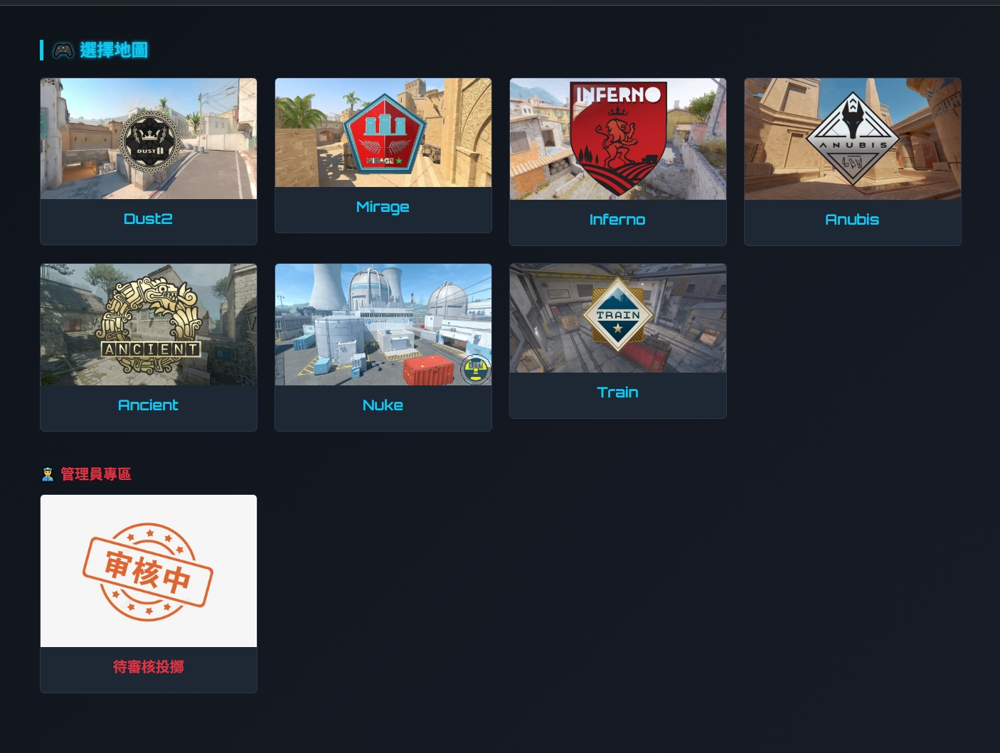
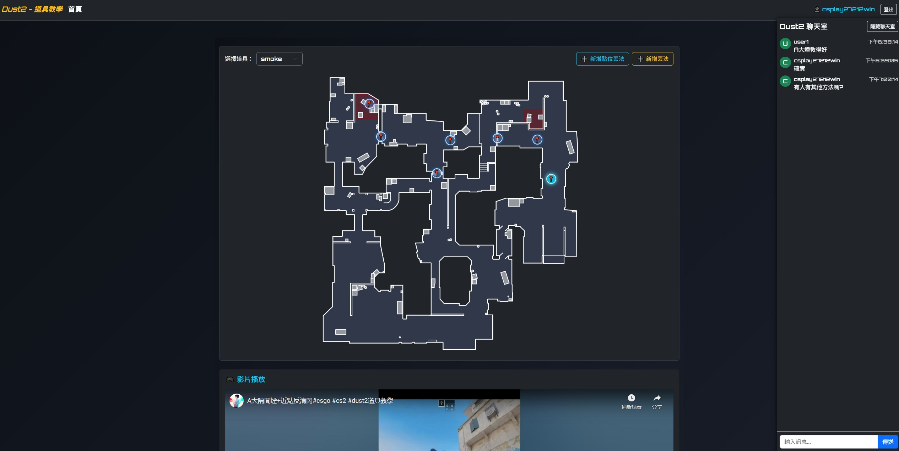
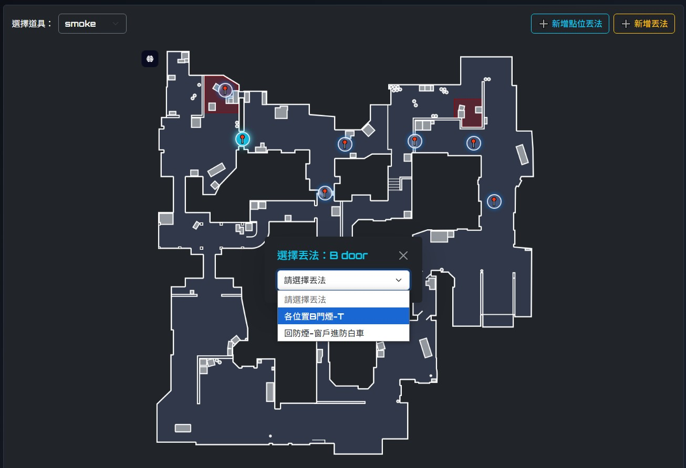
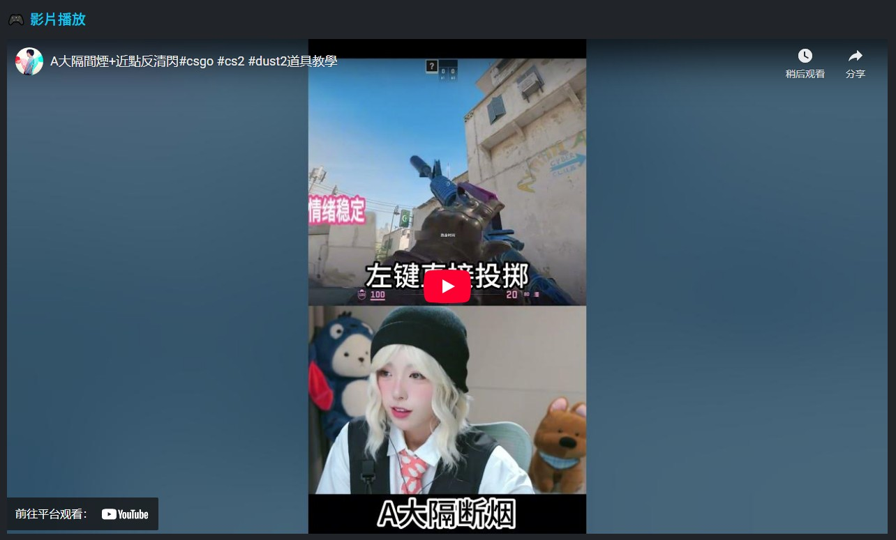
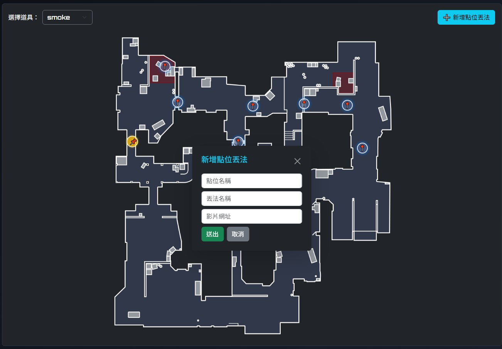
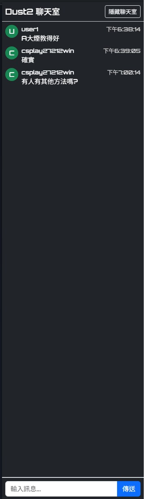
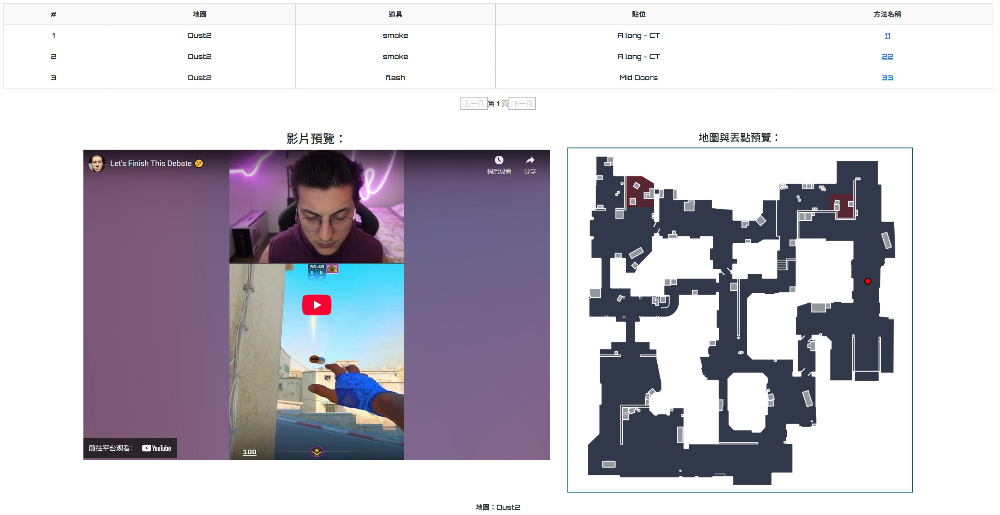

這是一個為《Counter-Strike》玩家設計的全功能手榴彈教學平台，使用者可透過互動地圖直覺點選投擲點位，觀看對應教學影片，學習各類煙霧彈、閃光彈與燃燒彈的擲法。平台整合登入系統，支援使用者上傳自訂點位與教學影片，並提供聊天室互動與管理員審核機制，提升教學品質與社群參與度。

首頁畫面(管理員有專屬區域):

內容呈現:

選擇道具 點位 丟法:

影片播放:

登入系統後可以新增點位及方法:

即時聊天室:

管理員審核區:

